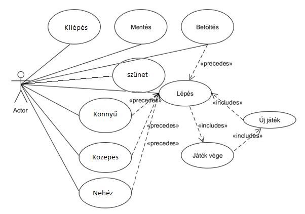
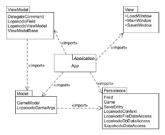
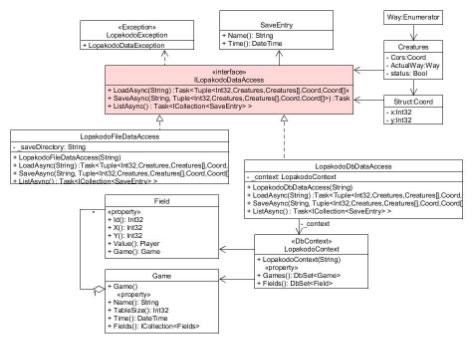
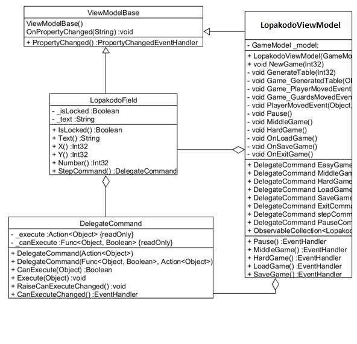

Horváth Milán  3.beadandó  2018.12.31 B1V655 

Feladat: 

**Lopakodó** 

` `Készítsünk programot, amellyel a következő játékot játszhatjuk. 

` `Adott  egy   ×   elemből  álló  játékpálya,  amely  falakból  és  padlóból  áll,  valamint  őrök járőröznek rajta. A játékos feladata, hogy a kiindulási pontból eljusson a kijáratig úgy, hogy közben az őrök nem látják meg. Természetesen a játékos, illetve az őrök csak a padlón tudnak járni. Az őrök adott időközönként lépnek egy mezőt (vízszintesen, vagy függőlegesen) úgy, hogy folyamatosan előre haladnak egészen addig, amíg falba nem ütköznek. Ekkor véletlenszerűen választanak egy új irányt, és arra haladnak tovább. Az őr járőrözés közben egy 2 sugarú körben lát (azaz egy 5 × 5-ös négyzetet), ám a falon nem képes átlátni. A játékos a pálya előre megadott pontján kezd, és vízszintesen, illetve függőlegesen mozoghat (egyesével) a pályán. A pályák méretét, illetve felépítését (falak és kijárat helyzete, játékos és őrök kezdőpozíciója) tároljuk fájlban. A program legalább 3 különböző méretű pályát tartalmazzon. A program biztosítson lehetőséget új játék kezdésére a pálya kiválasztásával, valamint játék szüneteltetésére (ekkor nem telik az idő, és nem léphet a játékos). Továbbá ismerje fel, ha vége a játéknak. Ekkor jelenítse meg, hogy győzött, vagy veszített-e a játékos. 

Elemzés: 

- A játék 3 pályaméreten játszható: 9x9, 12x12 és 15x15.  
- A feladatot egyablakos asztali alkalmazásként WPF grafikus felülettel valósítjuk meg.  
- Az Fájl menűpontban lehet kiválasztani a tetszőleges pályaméretet.  
- A játéktábált gombokból álló rács reprezentálja, a pályamérettől függően, az objektumok jelölése a következő:  
- P: Játékost jelöli a pályán 
- W: Falakat jelöli a pályán 
- E: Kijáratot jelöli a pályán 
- G: Őröket jelöli a pályán 
- A játéknak akkor van vége, ha meghal a játékos, vagy kijut, ekkor felugró ablak értesíti a játékost, hogy nyert-e.  

  

Felhasználói esetek. 

Tervezés:  

- Programszerkezet: 
- A programot MVVM architektúrában valósítjuk meg, ennek megfelelően View, Model, ViewModel és Persistence névtereket valósítunk meg az alkalmazáson belül. A program környezetét az alkalmazás osztály (App) végzi, amely példányosítja a modellt, a nézetmodell és a nézetet, biztosítja a kommunikációt, valamint felügyeli az adatkezelést. 

Az alkalmazás csomagdiagramja 

Elemzés:  

- Programszerkezet:  
- A programot háromrétegű architektúrában valósítjuk meg. A megjelenítés a Veiw, a modell a Model, míg a perzisztencia a Persistence névtérben helyezkedik el.  
- Perzisztencia:  
- Az adatkezelés feladata a falak, a játékos, és az őrök pozíciójának fájlba írása vagy abból olvasása, valamint a betöltés/mentés biztosítása. 
- Hosszútávú adattárolásra az ILopakodoDataAccess interfész ad lehetőséget, ami lehetőséget ad az állapotok betöltésére (LoadAsync) és mentésére (SaveAsync).  
- Az interfész szöveges fájl alapú adatkezelését a LopakodoFileDataAccess osztály valósítja meg. A fájlkezelés során fellépő hibákat a LopakodoDataExeption kivétel jelzi.  
- A fájl első sora a pálya méretét mondja meg, a játékos életét és a kijárat pozícióját. A második az őrök pozícióját, a harmadik pedig a falak pozícióját. 
- Az interfész adatbázis alapú adatkezelését a LopakodoDbDataAccess osztály valósítja meg. Az adatbáziskezelés során fellépő hibákat a LopakodoDataExeption kivétel jelzi.  
- A program az adatokat tehát tudja szöveges fájlként tárolni (melyek a „.lop” kiterjesztést kapják) vagy adatbázisban is (az App.config konigurációs állományban megadott connection string által leírt módon). Ezeket az adatokat a programban bármikor be lehet tölteni, illetve ki lehet menteni az aktuális állást. 

  

A perzisztencia osztálydiagrammja 

- Modell:  
- A modell lényegi részét a GameModel osztály valósítja meg, ahol lekezeljük a játékosok lépéseit és nem engedjük, hogy a méreten túl indexeljenek az objektumok.  
- Az osztály a játék paramétereit kezeli, a tábla adatait, és az objektumokat.  
- A sikeres lépés felvételről a MoveNumberUpdate értesít, lépésekről és támadásokról a MoveAndAttackPigs, játék végéről pedig a GameOver esemény tájékoztat. Az események argumentumait a (GameEventsArgs) tárolja.

A modellosztálydiagrammja 

- Nézetmodell (5. ábra):  
- A nézetmodell megvalósításához felhasználunk egy általános utasítás (DelegateCommand), valamint egy ős változásjelző (ViewModelBase) osztályt. 
- A nézetmodell feladatait a LopakodoViewModel osztály látja el, amely parancsokat biztosít az új játék kezdéséhez, játék betöltéséhez, mentéséhez, valamint a kilépéshez. A parancsokhoz eseményeket kötünk, amelyek a parancs lefutását jelzik a vezérlőnek. A nézetmodell tárolja a modell egy hivatkozását (\_model), de csupán információkat kér le tőle, illetve a játéknehézséget szabályozza. Direkt nem avatkozik a játék futtatásába.  
- A játékmező számára egy külön mezőt biztosítunk (LopakodoField), amely eltárolja a 

  pozíciót, szöveget, engedélyezettséget. A mezőket egy felügyelt gyűjteménybe helyezzük a nézetmodellbe (Fields). 

- Nézet:  
- A nézet csak egy képernyőt tartalmaz, a MainWindow osztályt. A nézet egy rácsban tárolja a játékmezőt, a menüt és a státuszsort. A játékmező egy ItemsControl vezérlő, ahol dinamikusan felépítünk egy rácsot (UniformGrid), amely gombokból áll. Minden adatot adatkötéssel kapcsolunk a felülethez, továbbá azon keresztül szabályozzuk a gombok színét is.  
- A fájlnév bekérését betöltéskor és mentéskor, valamint a figyelmeztető üzenetek megjelenését beépített dialógusablakok segítségével végezzük.  

A Nézetmodell osztálydiagramja 

- Környezet (5. ábra): 
- Az App osztály feladata az egyes rétegek példányosítása (App\_Startup), összekötése, a nézetmodell, valamint a modell eseményeinek lekezelése, és ezáltal a játék, az adatkezelés, valamint a nézetek szabályozása. 

A vezérlés osztálydiagramja

Tesztelés: 

- A modell funkcionalitása egységtesztek segítségével lett ellenőrizve a GameModelTest 

osztályban  

- Az alábbi tesztesetek kerületek megvalósításra:  
- EasyGame, MiddleGame, HardGame A megfelelő méretű táblát létrehozzuk, megnézzük, hogy a playert jó helyre generálta-e le a program, és hogy az életét megfelelően konstruálta-e meg. 
- MoveTest: A játékos lépését próbálja ki, hogy nem lépett-e le a pályáról, illetve-hogy reagál-e azokra a karakterekre, amelyekkel nem lehet irányítani.   
- LoadGameTest: Betölti az előre megadott pályát és egyesével ellenőrzi az objektumokat, hogy megfelelően generálódtak-e le. 
